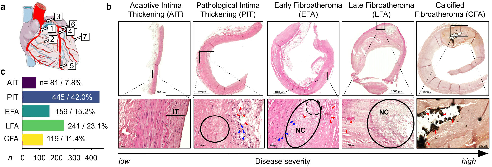
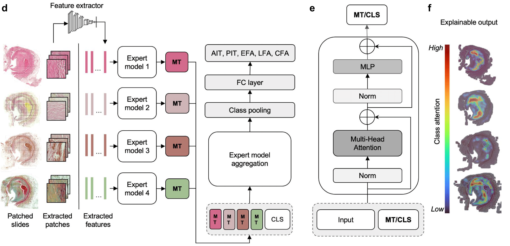
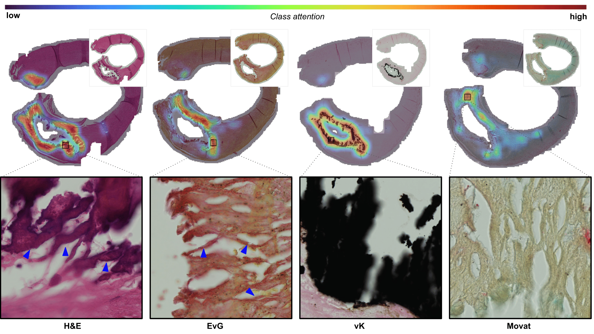

# UNICORN: A Deep Learning Model for Integrating Multi-Stain Data in Histopathology

The integration of multi-stain histopathology images using deep learning addresses challenges in digital histopathology, particularly data heterogeneity and missing data. This study presents UNICORN (UNiversal modality Integration Network for CORonary classificatioN), a multi-modal transformer model designed for atherosclerosis severity classification. Our two-stage architecture employs domain-specific expert modules and an aggregation expert module to effectively process multi-stain histopathology images.

### MISSION Biobank and UNICORN Architecture


*a-c) Coronary artery segments used in the study, the histological classification, and the class distribution of the study cohort. 
d) The UNICORN architecture consists of expert modules specialized for processing features from different staining modalities, which are then aggregated through a specialized module to enhance classification performance. This architecture allows for missing data during inference as well as training.*

###  Attention Regions

*Highlighting the regions relevant for classification across the different stainings (H&E, EvG, vK, Movat) for a calcified fibroatheroma (CFA) case, with high attention regions shown in red.*

## Citation
If you find our work useful, please consider citing us:

```bibtex
@misc{koch2024unicorn,
      title={UNICORN: A Deep Learning Model for Integrating Multi-Stain Data in Histopathology}, 
      author={Valentin Koch and Sabine Bauer and Valerio Luppberger and Michael Joner and Heribert Schunkert and Julia A. Schnabel and Moritz von Scheidt and Carsten Marr},
      year={2024},
      eprint={2409.17775},
      archivePrefix={arXiv},
      primaryClass={cs.CV},
      url={https://arxiv.org/abs/2409.17775}, 
}
